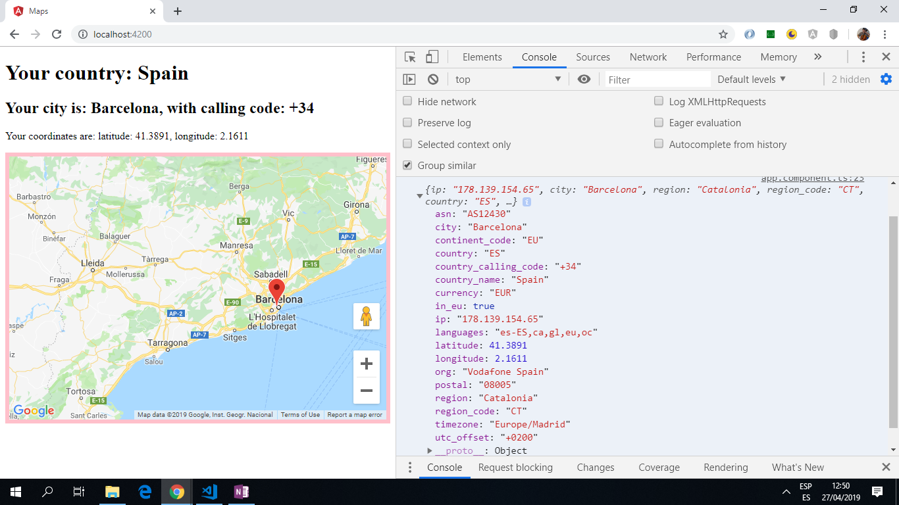

# Angular App Maps

* App using Angular 8, Angular Google Maps (AGM) and IPAPI.co to plot the user's location.

*** Note: to open web links in a new window use: _ctrl+click on link_**

## Table of contents

* [General info](#general-info)
* [Screenshots](#screenshots)
* [Technologies](#technologies)
* [Setup](#setup)
* [Features](#features)
* [Status](#status)
* [Inspiration](#inspiration)
* [Contact](#contact)

## General info

* Angular httpClient used to get API data.

## Screenshots

.

## Technologies

* [Angular v8.0.0](https://angular.io/)

* [Angular CLI v8.0.1](https://cli.angular.io/).

* [RxJS Library v6.5.2](https://angular.io/guide/rx-library) used to [subscribe](http://reactivex.io/documentation/operators/subscribe.html) to the API data [observable](http://reactivex.io/documentation/observable.html).

* [ipapi](https://ipapi.co/) API to get IP address. The API can also get city, region , country , continent, postal code, latitude, longitude, timezone, utc_offset, european union (EU) membership, country calling code, currency, languages spoken, asn and organization. Free service but location given is highly inaccurate.

Http request format: GET `https://ipapi.co/{format}/`

* [Angular Google Maps](https://angular-maps.com/) component

## Setup

Run `ng serve` for a dev server. Navigate to `http://localhost:4200/`. The app does automatically reload if you change any of the source files.

## Code Examples

* `maps.service.ts` using httpClient to get map location details from the API.

```typescript

import { Injectable } from '@angular/core';
import { HttpClient } from '@angular/common/http';

interface Location {
  latitude: string;
  longitude: string;
  country_name: string;
  country_calling_code: string;
  city: string;
  ip: 0;
}
@Injectable({
  providedIn: 'root'
})
  
export class MapsService {
  constructor(private http: HttpClient) {}

  getLocation() {
    return this.http.get<Location>('https://ipapi.co/json/');
  }
}

```

## Features

* IPAPI API used to get ip and location data etc. in json format.

* Angular Google Maps used to show location on a map using the lat and longitude from IPAPI API.

* Angular httpClient used to get data from an IPAPI API.

* Updated to latest Angular 8 version with all dependency conflicts resolved.

## Status & To-Do List

* Status: Working. app.module.ts has error '.../@angular/platform-browser has no exported member' but unable to fix. App still works.

* To-Do: add functionality  - present data using Angular form cards and add commenting. Fix above error.

## Inspiration

* [Coursetro Youtube video: Angular 7 Google Maps Tutorial with IPAPI (Plotting a User's Location)](https://www.youtube.com/watch?v=-IwTQgKIjCQ)

* [Academind: Google Maps & Angular | ANGULAR SNIPPETS](https://www.youtube.com/watch?v=lApggVS0icc) Using Google Maps

## Contact

Repo created by [ABateman](https://www.andrewbateman.org) - feel free to contact me!
